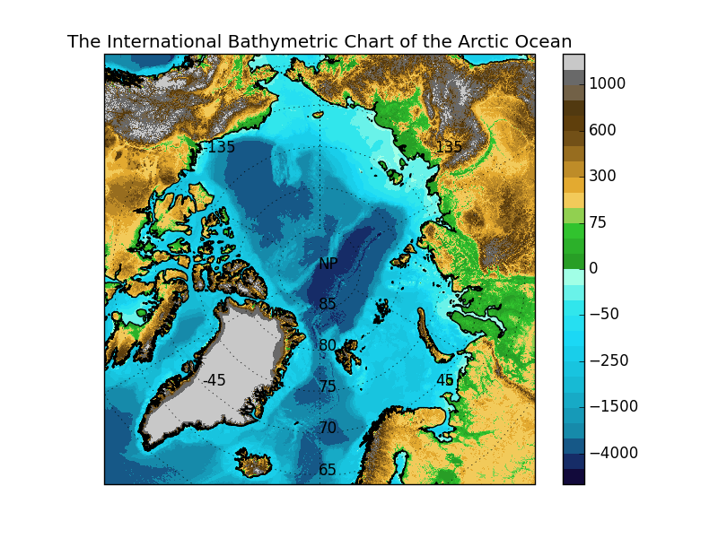

# IBCAO py
Class which sets up the [IBCAO](http://www.ngdc.noaa.gov/mgg/bathymetry/arctic/arctic.html) (projection and loads file) for use with [Matplotlib](http://matplotlib.org/) and [Cartopy](http://scitools.org.uk/cartopy/).

The [IBCAO](http://www.ngdc.noaa.gov/mgg/bathymetry/arctic/arctic.html) is
distributed using the Universal Polar Stereographic projection (UPS) with custom
parameters and grid-spacing. This package sets up the projection correctly, and
loads the map data in an efficient way. This ensures that no transformation is
needed when plotting the map, and that data that is plotted on the map is
correctly positioned. A ready figure with the map loaded is provided, with a
plotting transformation to the Geodetic projection ready so that data provided
in the familiar latitude and longitude coordinates may be plotted easily.

Additionally, efficient interpolation routines for reading the bathymetry
(depth) from the map data at coordinates, tracks or grids of coordinates are
provided so that these may be easily read.



## Installation

Use setuptools:
```sh
$ python setup.py build
$ python setup.py install
```

## Usage

1. Download the IBCAO grid: [ngdc.noaa.gov](http://www.ngdc.noaa.gov/mgg/bathymetry/arctic/grids/version3_0/IBCAO_V3_500m_RR.grd.gz) and specify it when you instantiate the IBCAO class or place it in the same directory as `ibcao.py`.

2. Run a test with:

```sh
$ python ibcao.py
```

3. a) Have a look at the demonstration for how to [get started with the package](https://github.com/gauteh/ibcao_py/blob/master/doc/IBCAO%20demonstration.ipynb) and check out [the API reference](http://ibcao-py.readthedocs.io/en/latest/).

   b) or to get started as quick as possible, do something like:
```python
  from ibcao import *

  i = IBCAO ()
  f = i.template ()
  f.show ()
```

## Contributing or reporting issues

Please report issues at the github repository: http://github.com/gauteh/ibcao_py. Patches and improvements are very welcome to be submitted either by a pull-request through github or by e-mail. Contributions must be made under the same license as this package (LGPLv3).

## Reference

> The IBCAO is provided by: <br />
> <br />
> Jakobsson, M., L. A. Mayer, B. Coakley, J. A. Dowdeswell, S. Forbes, B. Fridman, H. Hodnesdal, R. Noormets, R. Pedersen, M. Rebesco, H.-W. Schenke, Y. Zarayskaya A, D. Accettella, A. Armstrong, R. M. Anderson, P. Bienhoff, A. Camerlenghi, I. Church, M. Edwards, J. V. Gardner, J. K. Hall, B. Hell, O. B. Hestvik, Y. Kristoffersen, C. Marcussen, R. Mohammad, D. Mosher, S. V. Nghiem, M. T. Pedrosa, P. G. Travaglini, and P. Weatherall, The International Bathymetric Chart of the Arctic Ocean (IBCAO) Version 3.0, Geophysical Research Letters, doi: 10.1029/2012GL052219.


## Licence / Copyright / Attribution

Author: Gaute Hope / gaute.hope@nersc.no

This work is licensed under the GNU Lesser General Public Licence (LGPLv3).

