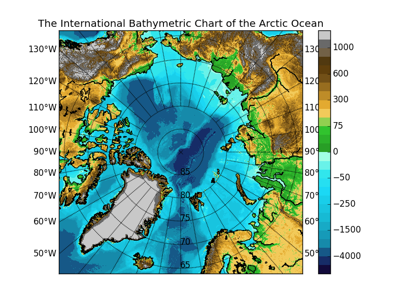

# IBCAO py

Class which sets up the [IBCAO](http://www.ngdc.noaa.gov/mgg/bathymetry/arctic/arctic.html) (projection and loads file) for use with Matplotlib.

> The IBCAO is provided by: <br />
> <br />
> Jakobsson, M., L. A. Mayer, B. Coakley, J. A. Dowdeswell, S. Forbes, B. Fridman, H. Hodnesdal, R. Noormets, R. Pedersen, M. Rebesco, H.-W. Schenke, Y. Zarayskaya A, D. Accettella, A. Armstrong, R. M. Anderson, P. Bienhoff, A. Camerlenghi, I. Church, M. Edwards, J. V. Gardner, J. K. Hall, B. Hell, O. B. Hestvik, Y. Kristoffersen, C. Marcussen, R. Mohammad, D. Mosher, S. V. Nghiem, M. T. Pedrosa, P. G. Travaglini, and P. Weatherall, The International Bathymetric Chart of the Arctic Ocean (IBCAO) Version 3.0, Geophysical Research Letters, doi: 10.1029/2012GL052219.



## Usage

Download the IBCAO grid: [ngdc.noaa.gov](http://www.ngdc.noaa.gov/mgg/bathymetry/arctic/grids/version3_0/IBCAO_V3_500m_RR.grd)

Run test with:
```sh
$ python ibcao.py
```

or in your code do something like:
```python
  print ("testing ibcao class")
  from ibcao import *
  import matplotlib.pyplot as plt
  import matplotlib.cm as cm

  m = IBCAO ()
  b = m.Basemap()

  b.drawcoastlines ()

  # only plot every 'div' data point
  div = 10
  zz = m.z.data[::div, ::div]

  dim = zz.shape[0]
  lons, lats = b.makegrid(dim, dim)
  x, y = b(lons, lats)

  (cmap, norm) = m.Colormap ()
  plt.pcolormesh (x, y, zz, cmap = cmap, norm = norm)

  # set up meridians
  meridians = np.arange (0, 360, 10)
  b.drawmeridians (meridians, labels = [True, True, False, False])

  # parallels
  parallels = np.arange (70, 90, 5)
  b.drawparallels (parallels, labels = [False, False, True, True])

  plt.title ('The International Bathymetric Chart of the Arctic Ocean')
  plt.colorbar ()

  plt.show ()
```

## Licence / Copyright / Attribution

Author: Gaute Hope / gaute.hope@nersc.no

<a rel="license" href="http://creativecommons.org/licenses/by/4.0/"></a><br />This work is licensed under a <a rel="license" href="http://creativecommons.org/licenses/by/4.0/">Creative Commons Attribution 4.0 International License</a>.

