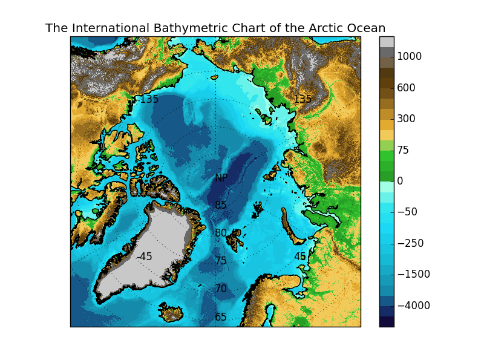

  ---
  title: 'IBCAO_py: A matplotlib library for using the International Bathymetric Chart of the Arctic Ocean with cartopy and matplotlib'
  tags:
    - ibcao
    - matplotlib
    - cartopy
    - python
    - gis
    - map
    - arctic
  authors:
   - name: Gaute Hope
     orcid: 0000-0002-5653-1447
     affiliation: 1
  affiliations:
   - name: Nansen Environmental and Remote Sensing Center
     index: 1
  date: 04 April 2017
  bibliography: ibcao_py.bib
  ---

  # Summary

  This is a python plotting toolbox for using the International Bathymetric
  Chart of the Arctic Ocean [@Jakobsson2012] with Cartopy [@Cartopy] in
  matplotlib [@matplotlib].

  The toolbox sets up the correct projection (Universal Polar Stereographic) so
  that the map is projected correctly and does not need to be re-projected.
  Plotting data defined for other coordinate systems is easy by using Cartopy's
  built in transformations. A demo is set up, and a test suite is included confirming the
  correctness of the setup, and showcasing some of the possibilities.

  -

  # References

